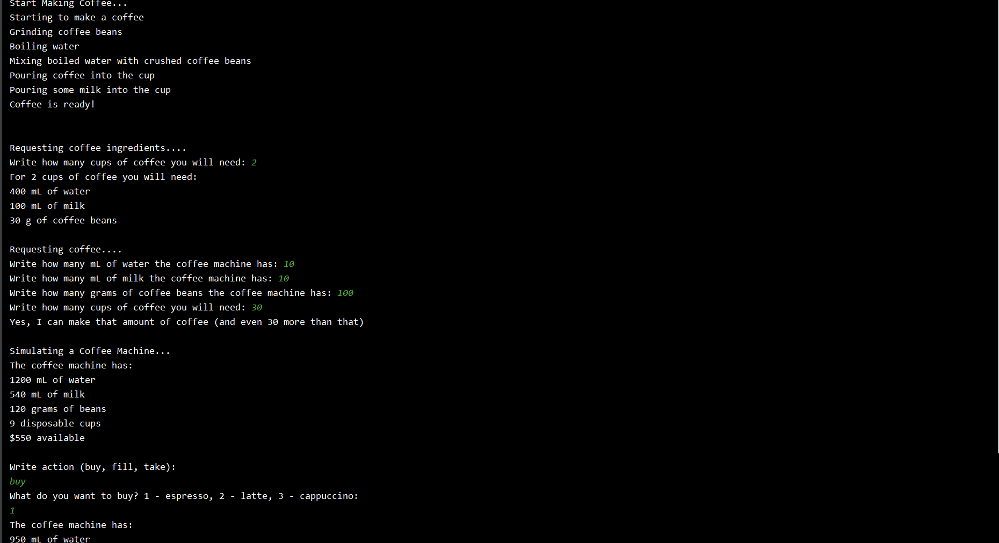

# CoffeeMachine
Simple Coffee Machine Simulator App that can make three types of coffee: espresso, latte, and cappuccino. It is capable of tracking the amount of ingredients (water, milk, and coffee beans) available in the machine. It also tracks amount of disposable cups and amount of money available for purchase.

Project Completed using JetBrains Hyperskill 
https://hyperskill.org/projects?goal=7

